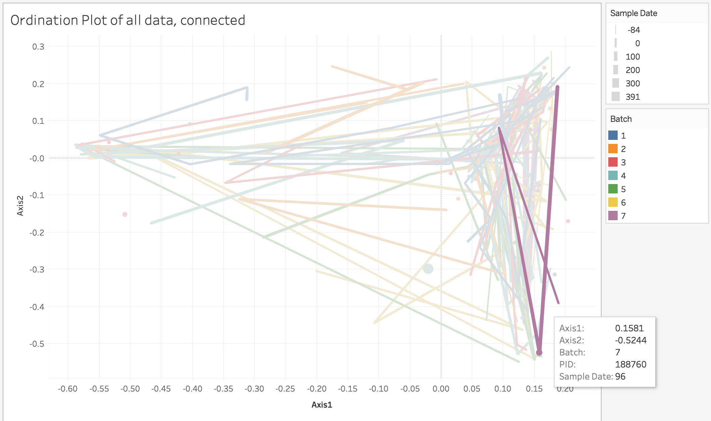
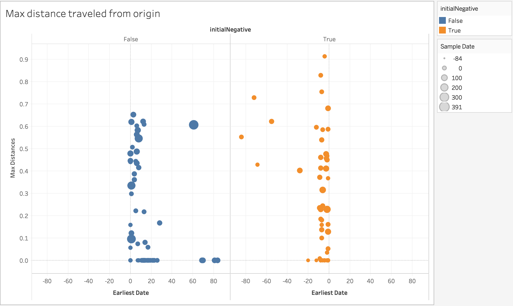
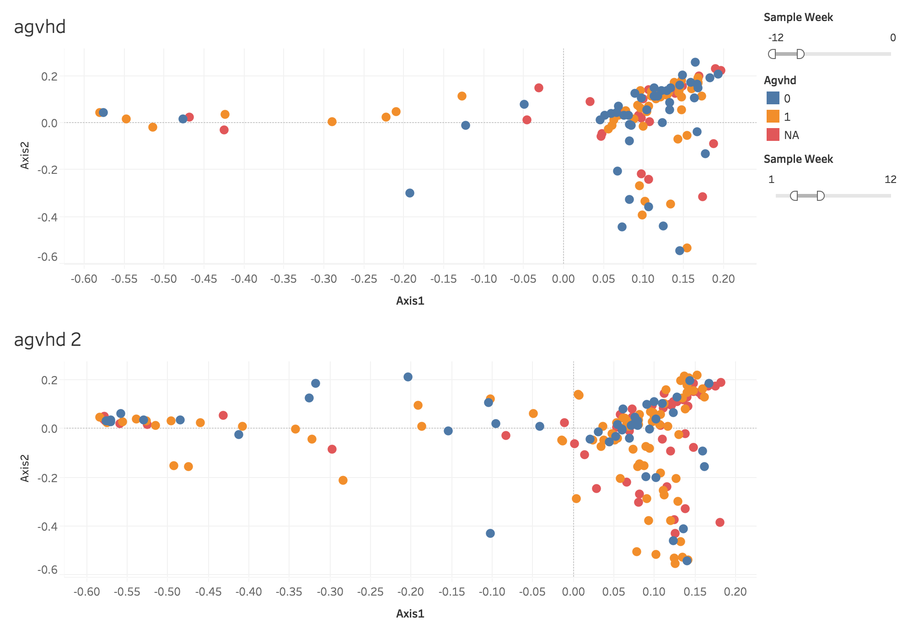

# Interactive Visualizations in Tableau

Tableau is a user-friendly application helpful in the design of interactive visualizations. We used this application to visualize the our data over time in our ordination plots and determine if there were any noticeable associations between variables in our metadata and the dynamics of our samples.

In each Tableau sheet created, hovering over a single point will cause that sample, as well as all other samples corresponding to the same patient, to be highlighted. This behavior allows us to specifically visualize how our samples' distributions change on an individual basis.

Figures 8, 9, and 10 include some examples of the plots designed in Tableau. 

Figure 8 depicts an ordination plot, colored by Batch number, and connected by patient ID. The thickness of lines connecting points to one another increases as time progresses. Hovering over a point will also highlight other sample points and the path representative of the selected patient.

Figure 9 shows plots of the maximum distance travelled by different patients, separated by whether or not their first sample date occurred before or after their transplant. It appears roughly that patients with first time points occurring before transplant date may have potentially higher maximum distances.

Figure 10 depicts two ordination plots colored by presence of acute graft versus host disease. The top plot depicts agvhd values taken within the twelve weeks prior to transplants, and the second plot depicts agvhd values taken within the twelve weeks after. Both plots can be manipulated to specify the desired time frame. This kind of visualization allows us to more directly compare the distributions of our covariates at different times.

With all of these plots, we were better able to interact with our data and the metrics that we had devised. However, while these visualizations were informative, we were still unable to specifically quantify potential associations between our various covariates and the dynamics of the gut microbiome.